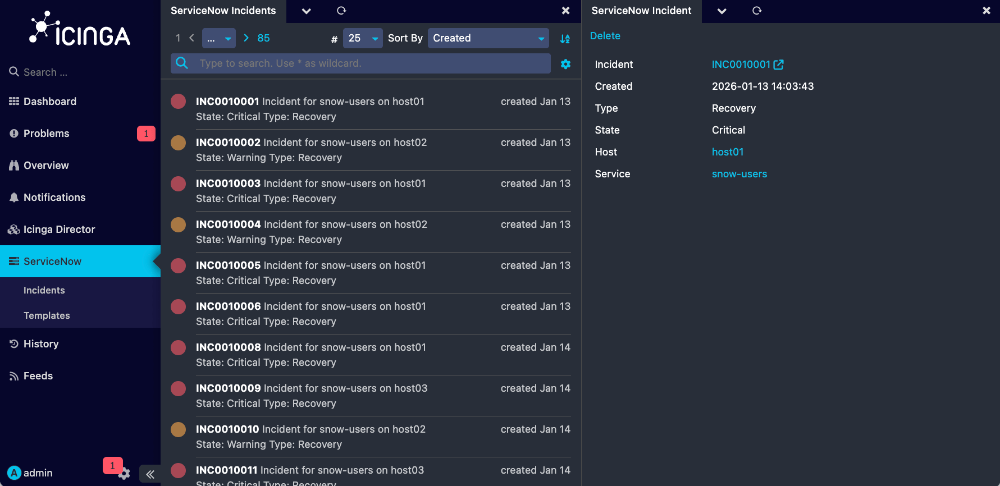

**Note:** This is an early release that is still in development and prone to change

# Icinga ServiceNow Integration Web

This module provides an Icinga integration with ServiceNow Incident Management.
It allows for Icinga notifications to be sent to ServiceNow in order to open, update and close incidents.

This module is able to:

* Create ServiceNow incidents for problems detected by Icinga
* Create only one incident per problem and update the incident on further notifications
* Show a list of open incidents for Host or Service objects
* Close and acknowledge ServiceNow incidents via Icinga notifications

## How it works

The Icinga ServiceNow Integration has two components:

* The [Icinga ServiceNow daemon](https://github.com/NETWAYS/icinga-servicenow), which receives notifications and sends them to ServiceNow.

* The [Icinga ServiceNow Web module](https://github.com/NETWAYS/icinga-servicenow-web), to provide a graphical interface and a CLI to send notifications to the daemon.
